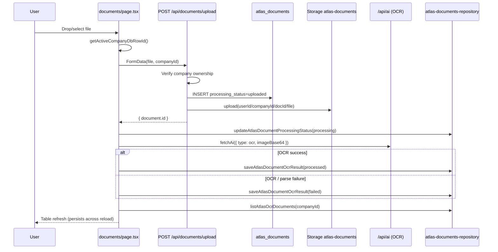

# OCR Pipeline Flow — Sprint D-alt

## Overview

Documents IA OCR: upload file → store in Supabase → extract via AI → persist structured fields → display in OCR tab and library.

## Sequence Diagram



## Status Transitions

| Status | Meaning | Set by |
|--------|---------|--------|
| `uploaded` | File in storage, DB row created | Upload API |
| `processing` | OCR in flight | Client before AI call |
| `processed` | Extraction saved | `saveAtlasDocumentOcrResult` |
| `failed` | AI error or invalid JSON | `saveAtlasDocumentOcrResult` |

## UI Status Mapping

`ocrUiStatus()` maps DB status to French UI labels:

- `processed` → **analysé**
- `uploaded`, `processing` → **en cours**
- `failed` → **erreur**

## Extraction Shape

```typescript
type AtlasOcrExtraction = {
  numero_facture?: string;
  date?: string;
  fournisseur?: string;
  montant_ht?: number;
  taux_tva?: number;
  montant_tva?: number;
  montant_ttc?: number;
  description?: string;
};
```

Stored in:

- `content` (JSONB)
- `metadata.ocr`
- `extracted_text` (stringified JSON)

## Retry-Safe Behavior

- Upload and DB insert are atomic from client perspective: failed storage upload rolls back DB row.
- OCR failure does **not** delete the file or row — status becomes `failed`, user can delete or re-upload.
- Duplicate processing: each upload creates a new document ID (no overwrite).
- Future: add “Retry OCR” that re-reads file from signed URL and re-runs AI without re-upload.

## Dev vs Production

| Mode | OCR list source | Upload path |
|------|-----------------|-------------|
| Supabase (`ATLAS_DATA_BACKEND=supabase`) | `listAtlasOcrDocuments` | `/api/documents/upload` |
| Local dev (non-supabase) | In-memory `localDocuments` | Direct AI, no persistence |

## AI Entry Point

Unchanged: `fetchAi({ type: 'ocr', imageBase64 })` → `/api/ai` with auth/subscription guards.

## Files

- `app/documents/page.tsx` — UI orchestration
- `app/api/documents/upload/route.ts` — upload handler
- `app/lib/atlas-documents-repository.ts` — persistence
- `app/lib/atlas-document-storage.ts` — bucket, paths, limits
- `app/lib/fetch-ai.ts` — AI client
