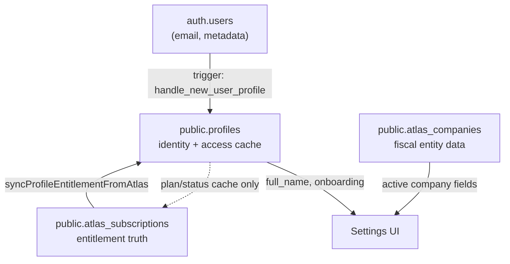

# Profile State Flow — ZAFIRIX PRO

How identity, onboarding, billing cache, and access control interact after Sprint B.

---

## Sources of truth

| Data | Source of truth | Cache / mirror |
|------|-----------------|----------------|
| Login session | Supabase Auth | JWT cookies |
| User name | `profiles.full_name` | Auth `user_metadata` (signup seed only) |
| Company fiscal fields | `atlas_companies` | `profiles.company_name` (label only) |
| Commercial plan | `atlas_subscriptions` | `profiles.plan` |
| Account lifecycle | Admin + sync rules | `profiles.status` |
| Onboarding done | `profiles.onboarding_completed` | localStorage prefs (dev/non-authoritative) |
| Admin privilege | `profiles.role` + owner email + JWT | — |

---

## Signup flow

1. User submits `/signup` → `supabase.auth.signUp`
2. DB trigger `on_auth_user_created_profile` inserts `profiles` row (`role=user`, `plan=free`, `status=pending`)
3. If session immediate: app creates first company + patches `full_name` / `company_name`
4. Trial claim API may run → `syncProfileEntitlementFromAtlas` sets `plan=free`, `status=active`
5. Redirect → `/onboarding`

---

## Onboarding flow

1. `/onboarding` loads → `getAtlasProfile()`
2. If `onboarding_completed === true` → `router.replace('/')` (no loop)
3. User completes wizard → `completeAtlasOnboarding()` → `profiles.onboarding_completed = true`
4. Analytics event `onboarding_completed` (telemetry, not authoritative)
5. Redirect `/` + sessionStorage checklist flag (UX only)

**Loop prevention:** DB flag is authoritative; revisiting `/onboarding` redirects home when complete.

---

## Middleware flow (every private route)

1. Require Supabase session
2. Load or recover `profiles` row (`ensureMiddlewareProfileRow`)
3. Normalize `role`, `status`
4. If `status === suspended` → `/access-denied`
5. If path `/admin/*` → check JWT admin OR owner email OR privileged role
6. Otherwise → allow (including `status=pending` — no false lockout)

**Profile recovery:** If row missing after auth, middleware inserts safe defaults (RLS + trigger protect privileged fields).

---

## Settings save flow

1. Load `getAtlasProfile()` + `getActiveAtlasCompany()`
2. On save:
   - `patchAtlasProfile({ full_name, company_name: raisonSociale })`
   - `saveActiveCompanyFields(...)` → `atlas_companies`
3. Refresh → both loads from Supabase

Production: **no localStorage authority** for profile or company when `atlasDataBackend() === 'supabase'`.

---

## Billing → profile sync (unchanged contract)

`app/lib/atlas-subscription-sync.ts`:

- Reads effective rows from `atlas_subscriptions`
- Writes `profiles.plan` (+ optionally `status=active` if entitled)
- Never overrides `suspended`
- Admin plan PATCH goes through `applyAdminProfilePlanToEntitlements` first

**Drift detection:** `detectProfilePlanDrift()` in `atlas-profile-guards.ts` compares cache vs expected bucket (diagnostic; no auto-repair in Sprint B).

---

## Privileged field protection

DB trigger `profiles_protect_privileged_fields`:

- Non–service-role INSERT → force `role=user`, `plan=free`, safe `status`
- Non–service-role UPDATE → `role`, `plan`, `status`, `email` frozen

User PATCH (client or `/api/profile`) can only change: `full_name`, `company_name`, `onboarding_completed`.
